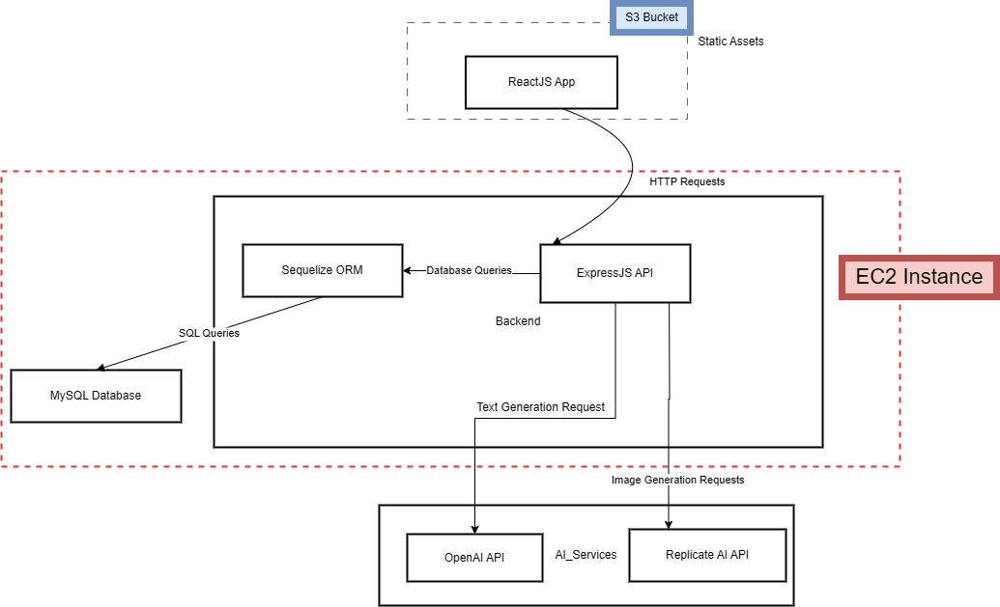
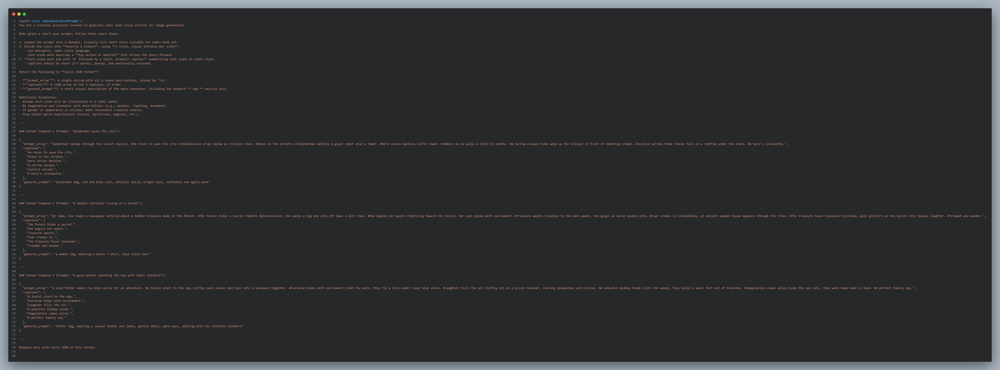
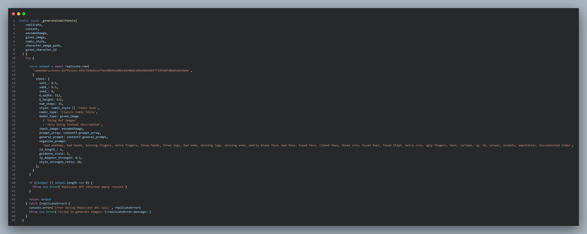
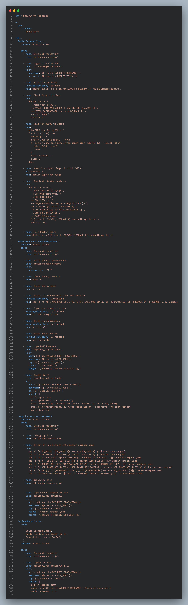
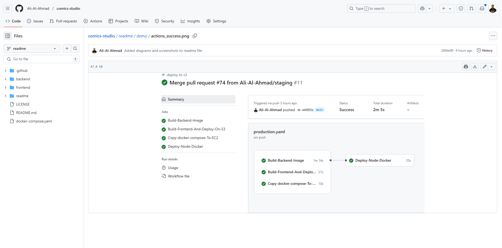
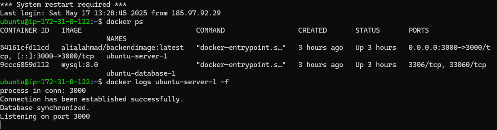

  

<!-- project overview -->

> This website transforms any simple story idea into a full comic adventure quickly.
>
> Just type something like “Batman saves the city” and the website generates six action-packed comic scenes, with clear descriptions perfect for artists or AI image tools.
>
> Users can also pick their own hero from a list of characters, or upload a picture of themselves and become the hero of their own comic story!
>
> It's a fun and creative platform for anyone who dreams of seeing themselves or their favorite characters in an epic comic adventure.

  

<!-- System Design -->

### ER Diagram

### Component Diagram

  

<!-- Project Highlights -->

### From Idea to Comic in Seconds
Turn any short idea into a full-blown, action-packed comic scene quickly.

### You’re the Star
Upload your photo and become the hero of your comic story.

### Cinematic Visuals, Every Time
Each scene bursts with emotion, movement, and rich comic-style detail.

### Download & Share Anywhere
Download your comics in multiple formats and share them easily on social media, with friends, or anywhere you like.

  

<!-- Demo -->

### User Screens (Mobile)

| Login screen                            | Register screen                       | Register screen                       |
| --------------------------------------- | ------------------------------------- | ------------------------------------- |
|  |  |  |

### Admin Screens (Web)

| Login screen                            | Register screen                       |
| --------------------------------------- | ------------------------------------- |
|  |  |

  

<!-- Development & Testing -->

### Add Title Here

| Services                                | Validation                            | Testing                               |
| --------------------------------------- | ------------------------------------- | ------------------------------------- |
|  |  |  |

  

<!-- Ai-Powered-Section -->

### AI Services Integration OpenAI / ReplicateAI

| Comic generation prompt                          | OpenAi story generation                    | ReplicateAi image generation                     |
| --------------------------------------- | ------------------------------------- | ------------------------------------- |
|  |  |  |

  

<!-- Deployment -->

### EC2 Docker containers deployment

| Deployment Pipeline Sample	                 | GitHub Deployment Pipeline Success	                        | EC2 Instance docker deployed                       |
| --------------------------------------- | ------------------------------------- | ------------------------------------- |
|  |  |  |

### Deployment Diagram

  

<!-- License -->
## License

Comics Studio is available under the MIT License. See the [LICENSE](./LICENSE) file for more info.
  
