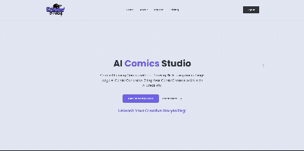
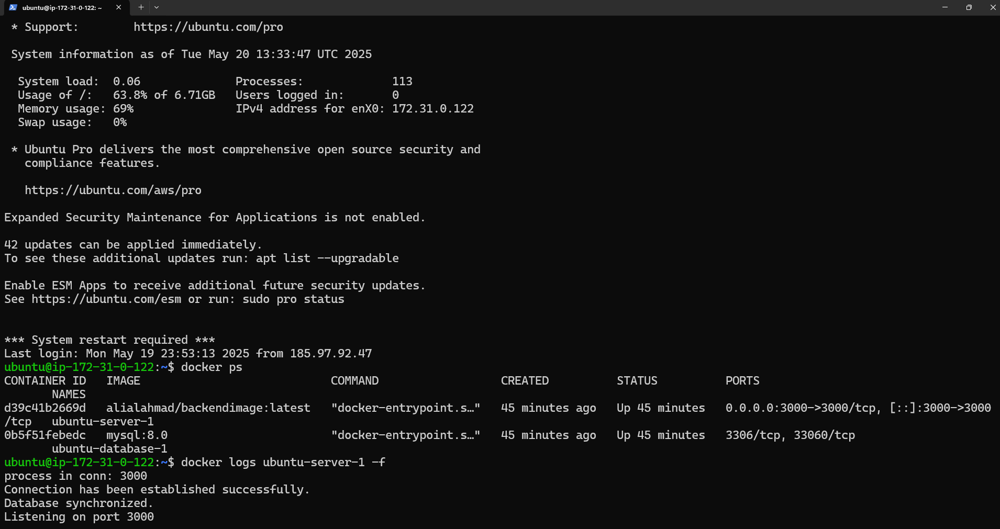
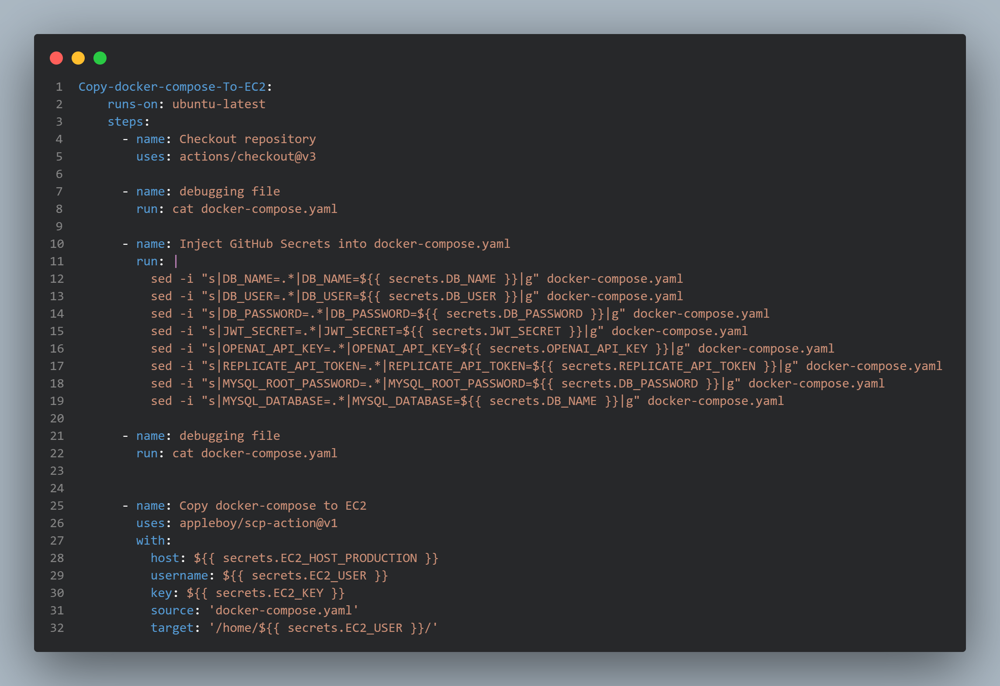

  

<!-- project overview -->

> This website transforms any simple story idea into a full comic adventure quickly.
>
> Just type something like “Batman saves the city” and the website generates six action-packed comic scenes, with clear descriptions perfect for artists or AI image tools.
>
> Users can also pick their own hero from a list of characters, or upload a picture of themselves and become the hero of their own comic story!
>
> It's a fun and creative platform for anyone who dreams of seeing themselves or their favorite characters in an epic comic adventure.

  

<!-- System Design -->

### ER Diagram

### Flow Diagram

### Component Diagram

  

<!-- Project Highlights -->

<!-- ### From Idea to Comic in Seconds
Turn any short idea into a full-blown, action-packed comic scene quickly.

### You’re the Star
Upload your photo and become the hero of your comic story.

### Cinematic Visuals, Every Time
Each scene bursts with emotion, movement, and rich comic-style detail.

### Download & Share Anywhere
Download your comics in multiple formats and share them easily on social media, with friends, or anywhere you like. -->

  

<!-- Demo -->

### User Screens

| Login screen                            |  Comic Screen                     |
| --------------------------------------- | ------------------------------------- |
|  | |

| Profile screen                            |  Characters Screen                     |
| --------------------------------------- | ------------------------------------- |
|  | |

| Landing screen                            | Creat Comic Screen                     |
| --------------------------------------- | ------------------------------------- |
|  | |

| ComicBook screen                    |  Comics Screen                     |
| ------------------------------------- |------------------------------------- |
|  ||

  

<!-- Development & Testing -->

### Postman API Testing
- You can view the full API documentation in Postman [here](https://documenter.getpostman.com/view/30826163/2sB2qXmiVS).

### Services & Middlewares

| Generate Comic Service       | Saving Panels To Data |
| --------------------------------------- | ------------------------------------- |
|  | |

| Authentication Middleware   |   Sequelize Modal Validation   |
| ------------------------------------- | ------------------------------------- |
|  |  |

### Code Test Cases

| Feature Test                            | Unit Test                              |
| --------------------------------------- |  ------------------------------------- |
|  |  |

| Local Tests Success                              | Pipeline Tests Success                        |
| --------------------------------------- | ------------------------------------- |
|  | |

  

<!-- Ai-Powered-Section -->

### AI Services Integration OpenAI / ReplicateAI

| Comic Generation Prompt Sample              |
| --------------------------------------- |
|  |

 | OpenAi Story Generation                    | ReplicateAi Image Generation  |
 | ------------------------------------- | ------------------------------------- |
 |  |  |

  

<!-- Deployment -->

### Deployment Overview 
  - **Deployed on S3:** [http://fse-final-ali-ah.s3-website.eu-west-3.amazonaws.com/](http://fse-final-ali-ah.s3-website.eu-west-3.amazonaws.com/)
  - Comics Studio deployed using **AWS EC2 instances**:
  - **Staging:** `http://15.236.247.74`
  - **Production:** `http://13.38.76.87`
- The project is **containerized using Docker** to ensure consistency across all environments.
- **CI/CD pipelines** are implemented via **GitHub Actions**, enabling automatic testing and deployment on every push to `staging` and `main`.

| GitHub Deployment Pipeline Success	                        | EC2 Instance Docker Deployed                       |
 | ------------------------------------- | ------------------------------------- |
| |  |

| AWS project objects	                 | Deployed production website  |   
| --------------------------------------- | ------------------------------------- |
|  |  |

### CI/CD Pipeline

| Backend Docker Image Build & Test          | Frontend Build And Deploy    |
 | ------------------------------------- | ------------------------------------- |
| |  |

| Copy To EC2 With Injected .env Passwords                 | Backend EC2 Deploy  |   
| --------------------------------------- | ------------------------------------- |
|  |  |

  

<!-- License -->
## License

Comics Studio is available under the MIT License. See the [LICENSE](./LICENSE) file for more info.
  
